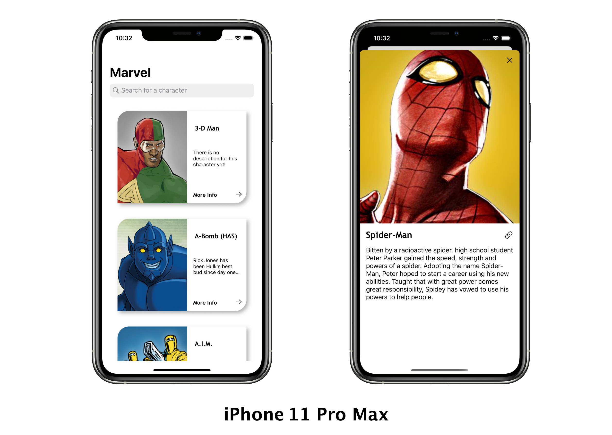

# 🦸🏻‍♂️ Marvel Characters 

This application was designed to solve the proposed challenge that should list Marvel characters on a screen with infinite scroll and detail each character on another screen.

Tech challenge requirements:
  - Make an application in the Swift language
  - Use Marvel API
  - The application must contain at least two screens
  - Use Git for versioning
  - Document the application build process in a README file.

# Features!

  - Search bar to find characters by name
  - Pagination
  - Error Handling
  - Dark Mode

You can also:
  - Get more information about the character by clicking on the hyperlink on the details screen

### Installation

Download, put your api key and run the project!

### Application

")

### Tech

- It is fed with content from The Marvel API
- The commitis followed the pattern "The seven rules of a great Git commit message"
- Was not necessary use third-party libraries

| Name | Documentation |
| ------ | ------ |
| Marvel API | https://developer.marvel.com/|
| Commits | https://chris.beams.io/posts/git-commit/|
| GitFlow | https://danielkummer.github.io/git-flow-cheatsheet/index.pt_BR.html|

### Development

As it had no architecture requirements, Model-View-Presenter with Router pattern was applied in this project. The application was developed aiming at good programming practices and clean code. A service layer is used to make calls in the API and the creation of screens and navigation is done with a Router.
The layout of the project is compatible with iPhones Max models and also of the smallest size up to 4.7 Inches.

### Todos

 - Do Unit Tests (Learing this stuff)
 - Localized Strings to support more languages
 - Animation on Splash Screen

